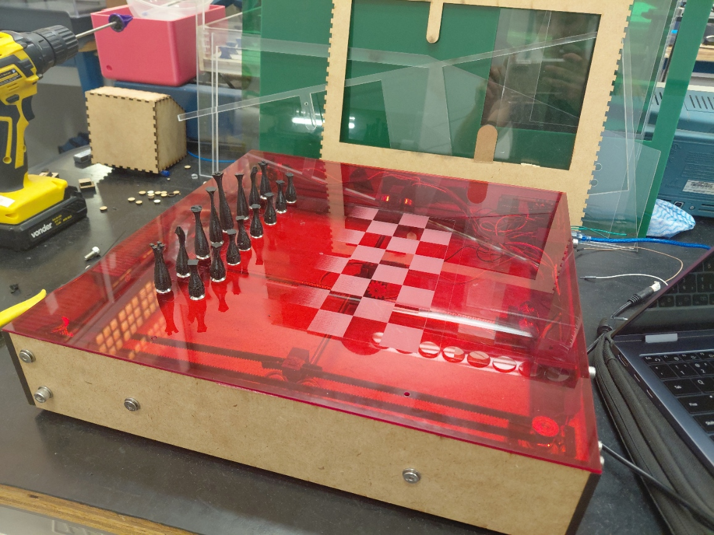

# Automated Robotic Chessboard

An automated, self-playing robotic chessboard that moves pieces autonomously and
tracks gameplay in real-time. The system utilizes a hidden motorized gantry with
magnets to move the pieces.
[
[![Vídeo Demonstração]](https://www.youtube.com/shorts/LDl5fLyFWHE)
